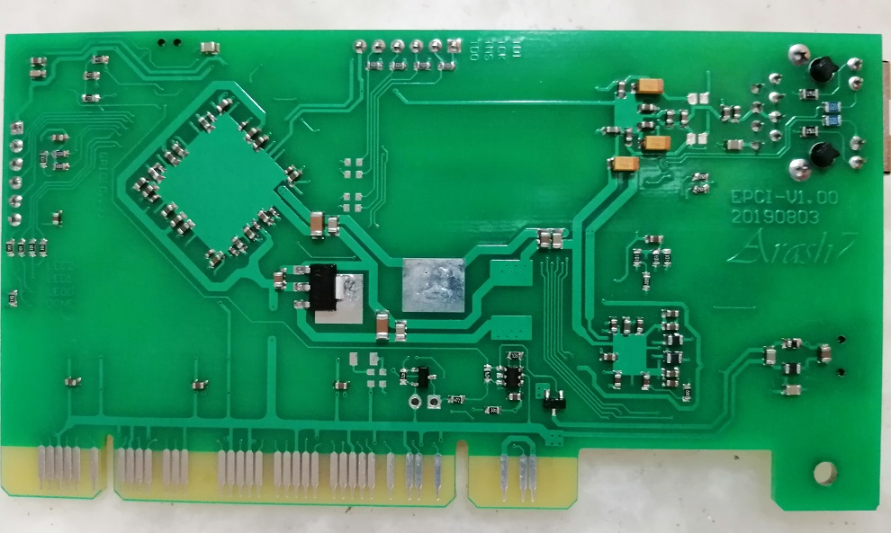

# Introduction

I always had a dream about HW/SW co-design of network controller. Like designing schematic / PCB, then develop FW/SW and so on ...

This is basically just a dream. But for my first iteration I'd decided to design a PCI network card.

As PCI is parallel (and a little simple) protocol, so I can handle (hopefully) hardware part of network card in LX9! 

Again, my design can be as simple as 2 layer PCB. There it  is!

# Specification

First of all, main idea of board came from **MESA-5I25** board from [mesanet.com](http://www.mesanet.com/fpgacardinfo.html). I've learn alot from their board (only it's pictures, I've never have one) and HDLs they provide for board.

- Universal PCI interface (5v0, 3v3)
- XC6SLX9-2TQG144I
- DP83848 (Ethernet PHY with MII interface to FPGA)
- W25Q64FV (32Mb x4 flash)
- FT2232H (As USB to serial and JTAG interface)

# Development 

I'm still working on HDLs. codes on FW/SRC  are simple demo for board functionality which:

- Provide 256 bytes BRAM in **first** 256 bytes of `BAR0`
- Provide 1 byte general output register in **second** 256 bytes of `BAR0` which control 3x LED on board

I've tested MII/MDIO interface via MicroBlaze soft core. They are working.

Here is my development setup:

Motherboard I'm using, is an old `G41M-E2SL` which runs Ubuntu-16.04 from **PXE/NFS**. So I have full control over kernel, initrd and rootfs. 

Check `Documents\pxe-menu` 

# Notes

1. If you want to use this board, as I and my good friend said: **Check it yourself** !
2. And ... Have fun ... 